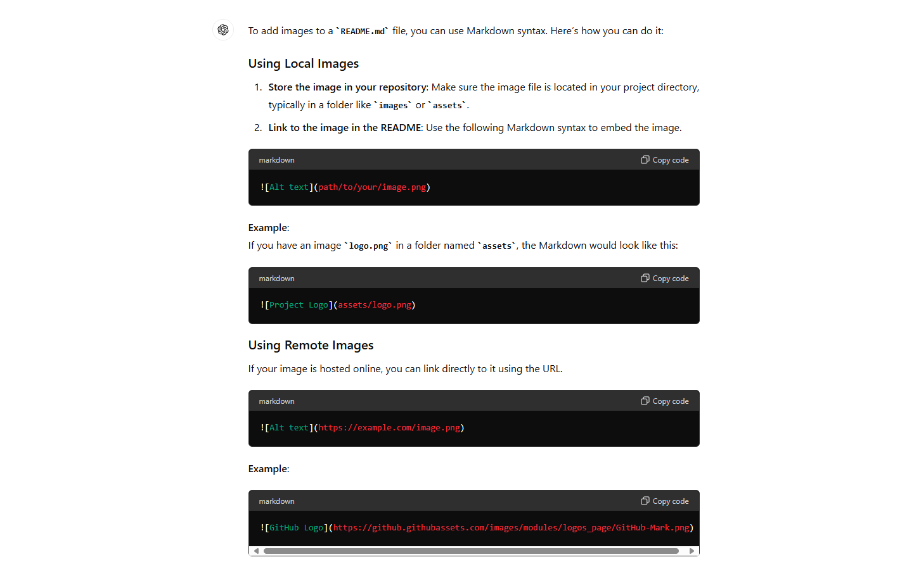
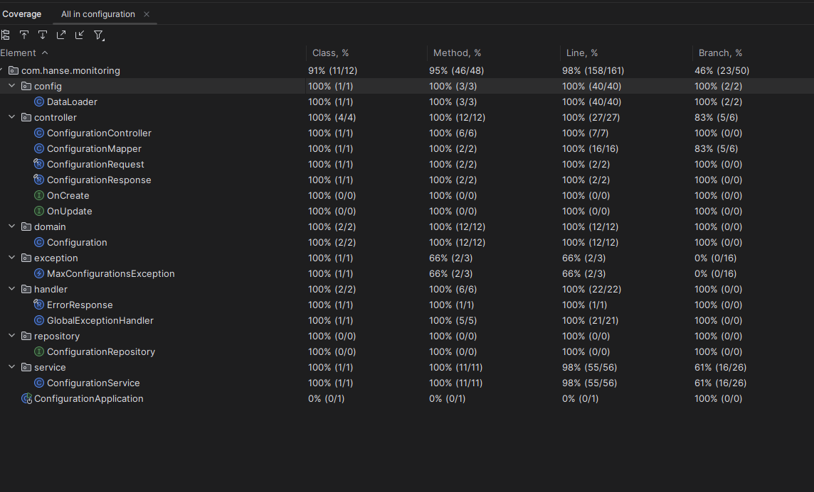
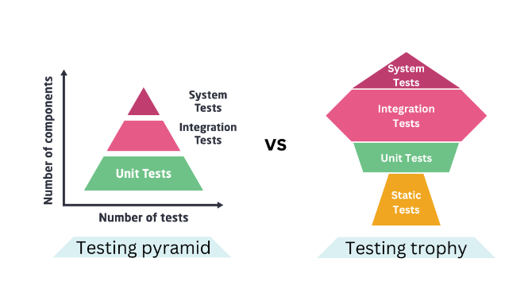

# Online Services Monitoring Tools

System supported by a set of microservices that work together to monitor online endpoints.
The system should be able to check the status of a group of pre configured endpoints, 
store the results in a database and provide a way to retrieve the results.

## Build/Installation 

**prerequisites**

- Docker installed --> Docker version 26.1.4

**steps**

1. In the project root directory "Monitoring-Tools" execute the following commands
```
docker compose build
```
```
docker compose up
```
If everything goes well no errors should appear, some situations that may cause errors are:
- The port 8070 is already in use
- The port 8071 is already in use
- The port 8072 is already in use
- The port 5433 is already in use
- The port 5434 is already in use
- The port 5050 is already in use
- Already exists a container with the name that the docker-compose is trying to create

The monitor-server may throw an error if the configuration-server or the analytics-server
are not ready, in this case, the monitor-server will retry and eventually will succeed.

After everything is up and running, the monitoring will start immediately because a group of
configurations are already in the database.

## Test

- **Test with postman**

    - **prerequisites**

          Postman installed --> Postman v11.2.0
    - import to postman the collection "Monitoring_Tools.postman_collection.json" file located in the project root directory
    - After import, the endpoints to test the configuration-server and analytics-server will be available


- **Test with OpenApi**

  Open the following urls (both applications need to be up) in your favourite browser and use the interface to test the RESTful API

        http://localhost:8070/swagger-ui/index.html
        http://localhost:8071/swagger-ui/index.html

## Architecture



**Technology Stack**

| **Technology**        	  | **Motive**			                                                                                                                             |
|--------------------------|-------------------------------------------------------------------------------------------------------------------------------------------|
| Spring Boot            	 | Helps manage Spring dependencies and have an embebed container to run the RESTfu API endpoints                                            |
| Spring Core    	         | Dependency Injection                                                                                                                      |
| Spring Web               | Expose the RESTful API (manage Servlets, ...), provides Rest Client                                                                       |
| Spring Data    	         | Integrate with JPA to enable ORM features                                                                                                 |
| Junit \ Mockito       	  | Unit Tests, Mockito helps mock dependencies so we can test the classes in isolation                                                       |
| Test Containers       	  | Helps the integration tests replacing the database with a test database (all integration tests can run with the database containers down) |
| Jacoco       	           | Test Coverage                                                                                                                             |
| Docker       	           | Deploy the applications and manages the environment                                                                                       |
| OpenAPI                  | Generate Interactive Documentation                                                                                                        |
| lombok                   | Eliminates boiler plate code                                                                                                              |

**Best Practices**

- Error Handling --> have been taken care with the help of the class "GlobalExceptionHandler" that helps intercept Exceptions and produce a readable error. Some return json, others string to showcase the different ways to return an error
- Unit Tests --> Only the configuration-server has unit tests because of time constraints, not all cases are covered, but the most important are. (report in --> services\configuration\jacoco)
  
- Integration Test --> More and more important nowadays, the test pyramid is changing, and the integration tests are becoming more important.

  
- Dependency Injection --> very important to achieve inversion of control and among other things helps create the mock objects used in tests.
- Automatic Documentation --> With the help of OpenApi
- Code Quality --> The code quality i believe is ok but could be better in a real project with the help of SonarQube, Checkstyle, code reviews, etc.
- Functionality --> The system is working as expected, although due to time constraints some improvements were not implemented and some bugs that i am unaware of may exist.:
  - On the fly configuration update (currently we need to stop the monitor-server , change the configuration and start again)
  - Alarm system in case of a endpoint is down or response time is too high
  - E2E tests are missing
  - Some input validations that require database queries are missing like unique name and unique url for example. (Custom Validator) 
