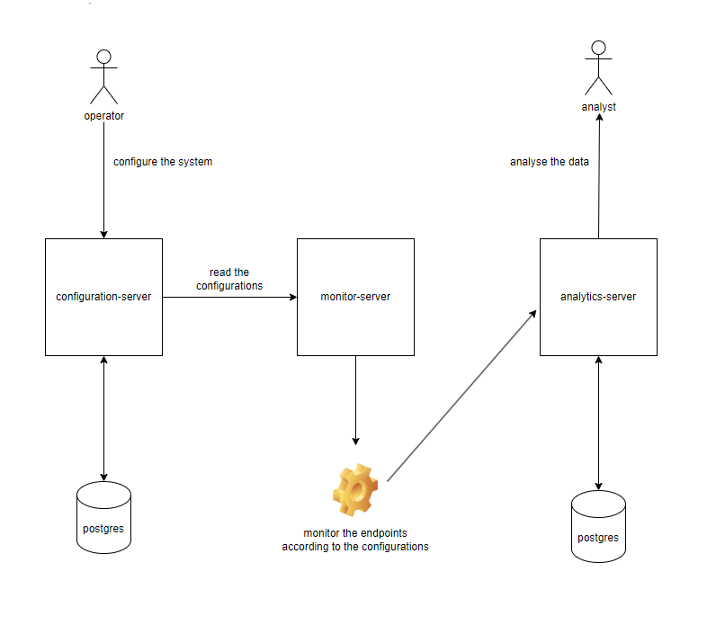

# Online Services Monitoring Tools

System supported by a set of microservices that work together to monitor online endpoints.
The system should be able to check the status of a group of pre configured endpoints, 
store the results in a database and provide a way to retrieve the results.

## Build/Installation 

**prerequisites**

- Docker installed --> Docker version 26.1.4

**steps**

1. In the project root directory "Monitoring-Tools" execute the following commands
```
docker compose build
```
```
docker compose up
```
If everything goes well no errors should appear, some situations that may cause errors are:
- The port 8070 is already in use
- The port 8071 is already in use
- The port 8072 is already in use
- The port 5433 is already in use
- The port 5434 is already in use
- The port 5050 is already in use
- Already exists a container with the name that the docker-compose is trying to create

The monitor-server may throw an error if the configuration-server or the analytics-server
are not ready, in this case, the monitor-server will retry and eventually will succeed.

After everything is up and running, the monitoring will start immediately because a group of
configurations are already in the database.

## Test

- **Test with postman**

    - **prerequisites**

          Postman installed --> Postman v11.2.0
    - import to postman the collection "Monitoring_Tools.postman_collection.json" file located in the project root directory
    - After import, the endpoints to test the configuration-server and analytics-server will be available


- **Test with OpenApi**

  Open the following urls (both applications need to be up) in your favourite browser and use the interface to test the RESTful API

        http://localhost:8070/swagger-ui/index.html
        http://localhost:8071/swagger-ui/index.html

## Architecture


